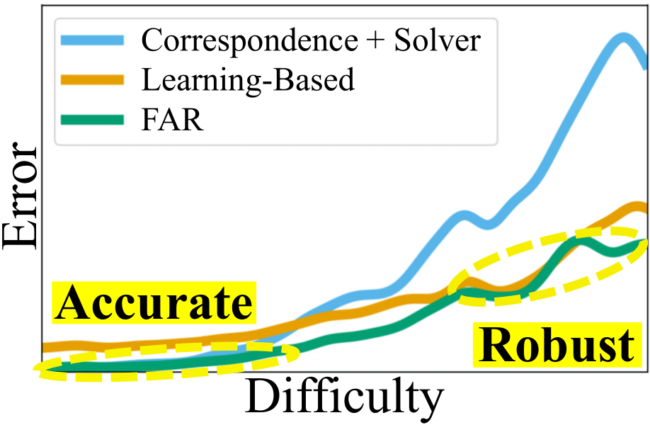

# [FAR: Flexible, Accurate and Robust 6DoF Relative Camera Pose Estimation](https://arxiv.org/abs/2403.03221)

<a href="https://crockwell.github.io/far/"></a> 
<a href="https://arxiv.org/abs/2403.03221"></a>

[Chris Rockwell<sup>1</sup>](https://crockwell.github.io), [Nilesh Kulkarni<sup>1</sup>](https://nileshkulkarni.github.io/), [Linyi Jin<sup>1</sup>](https://jinlinyi.github.io/), 
[Jeong Joon Park<sup>1</sup>](https://jjparkcv.github.io/), [Justin Johnson<sup>1</sup>](https://web.eecs.umich.edu/~justincj), [David F. Fouhey<sup>2</sup>](https://cs.nyu.edu/~fouhey/) \
<sup>1</sup>University of Michigan <sup>2</sup>New York University



<br />

FAR is a flexible method producing accurate \
and robust pose estimates using the \
complementary strengths of Correspondence + \
Solver and Learning-Based methods.

<br />

## Install

Make sure to clone recursively: 
```
git clone --recursive https://github.com/crockwell/far.git
```

For PyTorch2:
```sh
# requires cuda >= 11.7
conda env create -f environment.yml
conda activate far
```

For PyTorch 1 (consistent with LoFTR environment)
```sh
conda env create -f environment_pytorch_v1.yml
conda activate far_pytorch_v1
```

## Demo

Indoor (Trained on Matterport): 

```
# Go to folder
cd mp3d_loftr

# Download Pretrained Model
wget https://fouheylab.eecs.umich.edu/~cnris/far/model_checkpoints/mp3d_loftr/pretrained_models.zip --no-check-certificate
unzip pretrained_models.zip

# Run Demo
sh scripts/demo.sh
```

Outdoor (Trained on Map-Free Relocalization): 
```
# Go to folder
cd mapfree_6dreg

# Download Pretrained Model
wget https://fouheylab.eecs.umich.edu/~cnris/far/model_checkpoints/mapfree_6dreg/pretrained_models.zip --no-check-certificate
unzip pretrained_models.zip

# Download LoFTR Pretrained Model
pip install gdown; gdown https://drive.google.com/drive/folders/1xu2Pq6mZT5hmFgiYMBT9Zt8h1yO-3SIp -O etc/feature_matching_baselines/LoFTR/weights --folder

# Run Demo
sh scripts/demo.sh
```

## Evaluation

Download and data setup follow [Jin et al.](https://github.com/jinlinyi/SparsePlanes/blob/main/docs/data.md) (Matterport), [Cai et al.](https://github.com/RuojinCai/ExtremeRotation_code) 
(InteriorNet and StreetLearn), and [Arnold et al.](https://github.com/nianticlabs/map-free-reloc) (Map-free Relocalization).
- Matterport download can be performed as follows:
```
# Go to folder
cd mp3d_loftr

mkdir -p data/mp3d_rpnet_v4_sep20; cd data/mp3d_rpnet_v4_sep20; wget https://fouheylab.eecs.umich.edu/~jinlinyi/2021/sparsePlanesICCV21/split/mp3d_planercnn_json.zip --no-check-certificate; unzip mp3d_planercnn_json.zip
wget https://fouheylab.eecs.umich.edu/~jinlinyi/2021/sparsePlanesICCV21/data/rgb.zip --no-check-certificate; unzip rgb.zip
wget https://www.dropbox.com/s/217v5in4hzp4r0o/observations.zip; unzip observations.zip; cd ../..
```
- InteriorNet and StreetLearn require rendering; see [here](https://github.com/RuojinCai/ExtremeRotation_code#dataset) for full details.
We also cache LoFTR predictions on these datasets. LoFTR predictions can be downloaded as follows:
```
# Go to folder
cd interiornetStreetlearn_8ptVit

# we cache loftr predictions to be used
mkdir loftr_preds; cd loftr_preds
mkdir interiornet; cd interiornet; wget https://fouheylab.eecs.umich.edu/~cnris/far/loftr_preds/interiornet/test.zip --no-check-certificate; unzip test.zip; cd ..
mkdir streetlearn; cd streetlearn; wget https://fouheylab.eecs.umich.edu/~cnris/far/loftr_preds/streetlearn/test.zip --no-check-certificate; unzip test.zip; cd ../..
```
InteriorNet and StreetLearn pretrained models can be downloaded as follows:
```
wget https://fouheylab.eecs.umich.edu/~cnris/far/model_checkpoints/interiornetStreetlearn_8ptVit/pretrained_models.zip
unzip pretrained_models.zip
```
- Map-free Relocalization can be downloaded after agreeing to terms of service [here](https://research.nianticlabs.com/mapfree-reloc-benchmark/dataset).

Evaluation scripts are as follows:
```
# in the mp3d_loftr folder
sh scripts/eval_matterport.sh

# in the interiornetStreetlearn_8ptVit folder
# update INTERIORNET_STREETLEARN_PATH to rendered parent folder i.e. path/to/ExtremeRotation_code
sh scripts/eval_interiornet_t.sh
sh scripts/eval_streetlearn_t.sh

# in the mapfree_6dreg folder
# update the DATA_ROOT variable in the file "config/mapfree.yaml" to the local install path
sh scripts/eval_mapfree_loftr.sh
sh scripts/eval_mapfree_superglue.sh
```

- Please update `MATTERPORT_PATH` and `INTERIORNET_STREETLEARN_PATH` within scripts to root download directories.

## Training

Data setup is the same as in evaluation. Training scripts are as follows:
- Matterport3D
```
# in the mp3d_loftr folder
sh scripts/train_matterport.sh
```
- InteriorNet and StreetLearn
```
# in the interiornetStreetlearn_8ptVit folder
# first we need to cache LoFTR predictions on the train sets
mkdir loftr_preds; cd loftr_preds
mkdir interiornet; cd interiornet; wget https://fouheylab.eecs.umich.edu/~cnris/far/loftr_preds/interiornet/train.zip --no-check-certificate; unzip train.zip; cd ..
mkdir streetlearn; cd streetlearn; wget https://fouheylab.eecs.umich.edu/~cnris/far/loftr_preds/streetlearn/train.zip --no-check-certificate; unzip train.zip; cd ../..

sh scripts/train_interiornet_t.sh
sh scripts/train_streetlearn_t.sh
```
- Map-Free Relocalization
```
# in the mapfree_6dreg folder
# first, we need to download the pretrained model of Arnold et al.
mkdir weights; cd weights; wget https://storage.googleapis.com/niantic-lon-static/research/map-free-reloc/assets/mapfree_rpr_weights.zip; unzip mapfree_rpr_weights.zip; cd ..

# then run one or both of the following:
sh scripts/train_mapfree_loftr.sh
sh scripts/train_mapfree_sg.sh

# finally, upload to https://research.nianticlabs.com/mapfree-reloc-benchmark/submit
```
- Training consists of three phases. Step 1: training backbone + transformer (T<sub>t</sub> from the paper); Step 2: training backbone + transformer + solver (T<sub>1</sub> from the paper);
and Step 3: training training backbone + transformer + solver with prior (T from the paper). No translation is available on InteriorNet/StreetLearn, so we do not train the model with prior (Step 3) on these datasets.
When using a Correspondence-based backbone e.g. LoFTR on Matterport, we train the backbone before Step 1: training backbone + transformer.
Scripts should be updated to load the best checkpoint from the prior step in training monitored via rotation error.

## BibTeX

```
@inproceedings{Rockwell2024,
    author = {Rockwell, Chris and Kulkarni, Nilesh and Jin, Linyi and Park, Jeong Joon and Johnson, Justin and Fouhey, David F.},
    title = {FAR: Flexible, Accurate and Robust 6DoF Relative Camera Pose Estimation},
    booktitle = {CVPR},
    year = 2024
}
```

## Acknowledgements

Each backbone builds off the corresponding implementation: LoFTR from https://github.com/zju3dv/LoFTR, 8-Point ViT from https://github.com/crockwell/rel_pose, and 6DReg from https://github.com/nianticlabs/map-free-reloc.
Thanks to Jiaming Sun and Eduardo Arnold for their easily adapted code!

Thanks to Jeongsoo Park and Sangwoo Mo for
their helpful feedback. Thanks to Laura Fink and
UM DCO for their tireless computing support.
